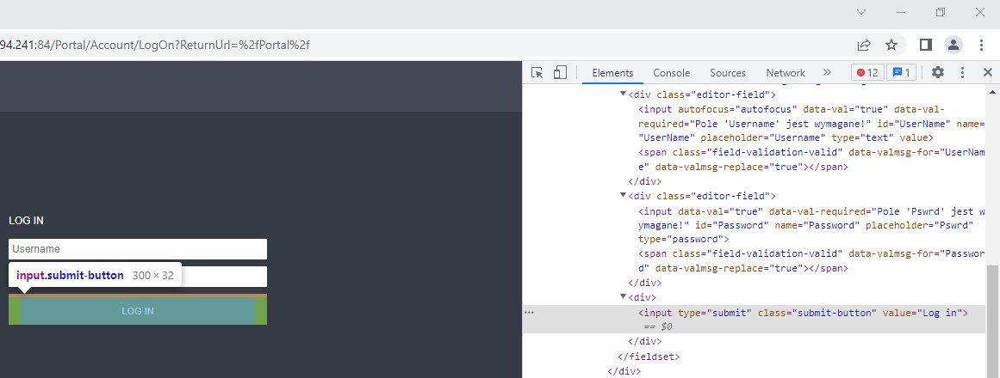

# Automatically opening and logging in to websites
Python script using the Selenium library for the Chrome web browser to automatically open and login websites.

### Table of Contents
* [General Information](#general-information)
* [Technologies Used](#technologies-used)
* [Sample script](#sample-script)
* [Issues](#issues)

### General Information
I use the script in my job to save time on repetitive tasks and at the same time I can perform other duties. For example, I want to check the prices of truck parts. I click on the previously prepared [truck.py](truck.py) file, which automatically opens several websites of online stores with truck parts and logs in to them. Otherwise, I want to check the prices of agricultural tractor parts. Then I click on the agriculture.py file, which automatically opens several pages of online stores with parts for agricultural tractors and logs in to them.

### Technologies Used
* Python 3.10.4
* Selenium 4.1.3
* ChromeDriver 101.0.4951.41
* Chrome 101.0.4951.67

### Sample script
Different cases you might come across. Below is an example script. The script can be written in a notepad and saved with the *.py extension. The code with the word "example" should be changed to elements from the website that we want to automate.

Library import, initialize the Chrome driver (located in the main directory):

```python
from selenium import webdriver
driver = webdriver.Chrome("chromedriver")
```

Opening the first website without logging:

```python
driver.maximize_window()
driver.get("https://example.website.com/")
```

Opening a second website with logging in (opening the website in new tab, filling in the login and password fields, click on the login button):

```python
username_example = "example_123456"
password_example = "example_qwerty"
driver.execute_script("window.open('');")
driver.switch_to.window(driver.window_handles[1])
driver.get("https://example.shop.com/clientcatalogue/searchform.aspx")
driver.find_element_by_id("example_ctl00_box_3_tbUserId").send_keys(username_example)
driver.find_element_by_id("example_ctl00_box_3_tbPassword").send_keys(password_example)
driver.find_element_by_name("example_ctl00$box_3$btnLogin").click()
```

Opening a third website with logging in (opening the website in new tab, filling in the login and password fields, click on the login button):

```python
username_example2 = "example_123456"
password_example2 = "example_qwerty"
driver.execute_script("window.open('');")
driver.switch_to.window(driver.window_handles[2])
driver.get('https://example.shop.com/Portal/Account/LogOn?ReturnUrl=%2fPortal')
driver.find_element_by_id("example_UserName").send_keys(username_example2)
driver.find_element_by_id("example_Password").send_keys(password_example2)
driver.find_element_by_css_selector("example_input[type='submit'][class='submit-button'][value='Log in']").click()
```

Opening of the fourth website (opening the website in new tab, click on the icon login, filling in the login and password fields, click on the login button):

```python
username_example3 = "example_123456"
password_example3 = "example_qwerty"
driver.execute_script("window.open('');")
driver.switch_to.window(driver.window_handles[3])
driver.get('https://example_shop.com/')
driver.find_element_by_id("example_ctl00_box_2_abcBoxContainer_box_2_abcBoxContainer_container").click()
driver.find_element_by_id("example_ctl00_box_2_abcBoxContainer_box_2_abcBoxContainer_box_2_tbUserId").send_keys(username_example3)
driver.find_element_by_id("example_ctl00_box_2_abcBoxContainer_box_2_abcBoxContainer_box_2_tbPassword").send_keys(password_example3)
driver.find_element_by_name("example_ctl00$box_2$abcBoxContainer$box_2$abcBoxContainer$box_2$btnLogin").click()
```


To identify the HTML elements of a website, right-click on its area. Select inspect from the menu.

### Issues

The "automation" blocking tools used on websites are becoming more effective. You may encounter captcha or page blocking when "automated" mode is detected. To get around this, you need to write more lines of code. You can find information on how to do this on the Internet.
